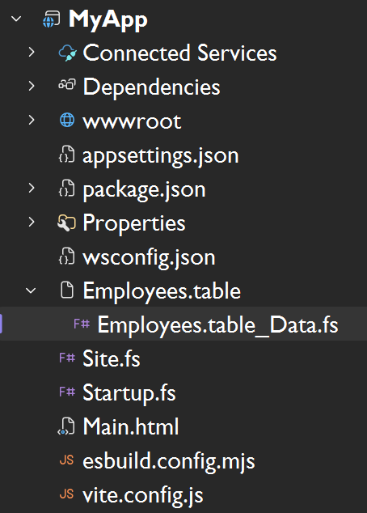

One of the major new features of the upcoming [WebSharper 10](https://websharper.com) is F# source code generators (SCGs), with an initial, rudimentary documentation available [here](https://docs.websharper.com/metaprogramming/fsharp-code-generators). While we haven't yet formally announced WebSharper 10, those who keep a closer look at the [WebSharper developer NuGet feed](https://github.com/orgs/dotnet-websharper/packages) could spot the first non-RC `10.0.0.x` releases. In this article, I will use the current latest release, `10.0.0.652`, and you can also follow along by checking out the [sources for this article](https://github.com/granicz/Tabler).

> ### Try it!
> (You will need the latest `dotnet` CLI,  `node` and `npm` installed on your system.)
>
> 1. Clone the repo: `git clone https://github.com/granicz/Tabler`
>
> 2. cd into the test app folder: `cd Tabler\MyApp`
>
> 3. Build and run it: `dotnet run`
>
> 4. Navigate to `https://localhost:5000`, (change port as needed and reported by the self-hosted `.exe`)

## Tabler - a SCG for annotated CSV files to tables

I will demonstrate WebSharper SCGs with a simple CSV to HTML converter. But instead of blindly turning raw data to HTML tables, we'll generate F# code - types that model the structure of the data and UI code that constructs a table rendering. To help code generation we'll add annotations to the CSV header, and codename the code generator for this transformation "Tabler".

Armed with Tabler, we can embed annotated CSV source files directly in WebSharper projects, with generated code appearing with every compilation.

<figure style="text-align: center;">
  
  <figcaption style="font-size: 0.9em; opacity: 0.7;">
    Figure 1: Tabler-generated file in VS
  </figcaption>
</figure>

A sample annotated CSV file looks like this:

```csv
# MyApp.Employees.Data = Person list {
#   "First Name"  -> FirstName: string
#   "Last Name"   -> LastName: string
#   "Age"		  -> Age: int
#   "Department"  -> Department: union
#   "Start Date"  -> StartDate: date
# }
First Name, Last Name, Age, Department, Start Date
Anna,Kovacs,29,Engineering,2021-04-12
Mark,Stevens,41,Finance,2016-09-01
Lucia,Ramirez,34,Marketing,2019-02-18
Peter,Nagy,38,Operations,2017-06-05
Sofia,Morales,26,Customer Support,2023-01-09
Daniel,Weber,45,Human Resources,2014-11-24
Emily,Chen,31,Product Management,2020-08-17
Robert,Klein,52,Legal,2010-03-22
Isabel,Fernandez,28,Design,2022-05-30
Thomas,OConnor,36,Sales,2018-10-08
```

Note the header block inside the commented lines. This section defines a fully qualified name `MyApp.Employees.Data` for the data that follows, names each row/record as `Person`, and describes a mapping from column headers (`"First Name"`) to an identifier*type pair. Here, for the type, there are four built-in types, which are straightforward to extend later: strings, numbers, dates, and unions. Unions provide a closed set of values extracted from the dataset, and can be used to model a finite set of possible values in a type-safe manner.

From the header metainfo we want to generate an F# record type to represent `Person` records/rows, along with a constructor helper. If any of the record fields are unions, their values are collected into a DU with a mapping function between DU values and data values.

So for the above CSV snippet, we expect to generate the following code:

```fsharp
namespace MyApp

module Employees =
    open System
    
    type Department = 
        | CustomerSupport
        | Design
        | Engineering
        | Finance
        | HumanResources
        | Legal
        | Marketing
        | Operations
        | ProductManagement
        | Sales
    
        override this.ToString() =
            match this with
                | CustomerSupport -> "Customer Support"
                | Design -> "Design"
                | Engineering -> "Engineering"
                | Finance -> "Finance"
                | HumanResources -> "Human Resources"
                | Legal -> "Legal"
                | Marketing -> "Marketing"
                | Operations -> "Operations"
                | ProductManagement -> "Product Management"
                | Sales -> "Sales"
    
    type Person =
        {
            FirstName: string
            LastName: string
            Age: int
            Department: Department
            StartDate: DateTime
        }
    
        static member Create (firstName, lastName, age, department, startDate) =
            {
                FirstName = firstName
                LastName = lastName
                Age = age
                Department = department
                StartDate = startDate
            }
    
```

## Rendering tables

Since the main use of Tabler is compile-time code generation to render HTML tables from raw CSV data, it is important that these tables can be styled according to the host page's theme.

We can accomplish this using WebSharper.UI templating. First, we assume that there is an HTML template file that contains the template markup for our table. For simplicity, we use a hardcoded name `Main.html` and generate a UI type provider call to generate a strongly-typed representation of the template under `MainTemplate`:

```fsharp
namespace MyApp

open WebSharper.UI.Templating

type MainTemplate=Template<"Main.html", ClientLoad.FromDocument>

module Employees =
    ...
```

From here, we assume that there are various inner templates defined in the master template file. For example, since we used `MyApp.Employees.Data` in the CSV header, we require:

 * `EmployeesTable_HeaderColumn` (=> a single header column) with a single `Header` placeholder, to represent a header cell.

 * `Employee` (=> a table row, and note the singular case) with placeholders whose names match the field names declared in the CSV header block. For instance, for `"First name"`, we declared `FirstName`, so this field needs to be present in the inner template, along all others.

 *  `Employees` (=> the full table) with a `HeaderRow`, `Data`, `Count` placeholders - this template gives the presentation artifact of the entire table. `HeaderRow` will be automatically populated by injecting all column headers (using the `EmployeesTable_HeaderColumn` template we saw above), `Data` will receive all rows (using `Employee`), and `Count` will be populated by the number of rows processed.

 So the final bit of the generated code, related to constructing these template-based blocks for the entire table, looks like this:

```fsharp
module Employees =
    ...

    let headerColumn (col: string) =
        MainTemplate.EmployeesTable_HeaderColumn()
            .Header(col)
            .Doc()
    
    let row (person:Person) =
        MainTemplate.Employee()
            .FirstName(person.FirstName)
            .LastName(person.LastName)
            .Age(string person.Age)
            .Department(person.Department.ToString())
            .StartDate(person.StartDate.ToShortDateString())
            .Doc()
    
    let Data =
        MainTemplate.Employees()
            .HeaderRow([
                headerColumn "First Name"
                headerColumn "Last Name"
                headerColumn "Age"
                headerColumn "Department"
                headerColumn "Start Date"
            ])
            .Data([
                row <| Person.Create ("Anna", "Kovacs", 29, Department.Engineering, DateTime.Parse "2021-04-12")
                ...
            ])
            .Count(string 10)
            .Doc()
```

## The SCG

Now that we have seen the code we want to generate, it's time to write our SCG. This will go into a separate project (`Tabler` in the [linked repository](https://github.com/granicz/Tabler)), which we will reference in our main app project.

SCGs declare one or more file extensions, for which they are activated in the compilation pipeline, so for every file added to a SCG-enhanced project with those file extensions, source code is generated (one or more F# files) and added to the list of source files to be compiled. Next to this, there is a single entrypoint `Generate` to implement, which will be called with each input file and some meta information about the compilation context.

The skeleton of our `.table` SCG looks like this:

```fsharp
namespace Tabler

open System.IO
open WebSharper

type TableSourceGenerator() =
    interface ISourceGenerator with
        member this.Generate (gen: GenerateCall) : string array option =
            let file = gen.FilePath
            File.ReadAllLines(file)
            |> Reader.ParseAll
            |> function
                | Ok res ->
                    ...
                    Some ...
                | Error e ->
                    ...
                    IDE.error gen pos e.Message
                    None

[<assembly:FSharpSourceGenerator("table", typeof<TableSourceGenerator>)>]
do ()
```

## Our CSV reader

Since we enhance CSV syntax with our custom comment header, we need to write a parser for it. I decided to go with a simple line-based parser and utilize `Result` values to weave each parsing step together, enabling me to handle syntax errors precisely.

First, I build a simple computation expression (CE) to compose `Result` values:

```fsharp
    type ResultBuilder() =
        member _.Bind(x, f) =
            match x with
            | Ok v    -> f v
            | Error e -> Error e

        member _.Return(x) = Ok x
        member _.ReturnFrom(x) = x

    let result = ResultBuilder()
```

Next, my line-based parser functions will all yield either an error that pinpoints what's wrong and where in the syntax, or a custom value that contains all the parsed data.

So my `ParseError` and a `Cursor` type to keep track of parsing position within a line looks like this:

```fsharp
    type ParseError =
        {
            Message: string
            StartLine: int
            StartColumn: int
            Length: int
        }

    type Cursor =
        {
            Text: string
            LineNumber: int
            Column: int
        }
```

Equally unimpressive is my built-in CSV field type and a helper to construct errors:

```fsharp
    type FieldType =
        | String
        | Int
        | Union
        | Date

    let error msg (line, col, length) =
        Error { Message = msg; StartLine = line; StartColumn = col; Length = length }
```

The heart of the main parser functions is `tryMatch` - a function that tries to match a given regex against a `Cursor` value:

```fsharp
    let tryMatch (lineNo, rxName, rx: Regex) (c: Cursor) =
        let m = rx.Match(c.Text, c.Column)
        if m.Success && m.Index = c.Column then
            Ok (m, { c with Column = c.Column + m.Length })
        else
            error $"Expected {rxName}" (lineNo, c.Column, 1)
```

Using this helper, we can extract the information from the first header line:

```fsharp
    type DataHeader =
        {
            QuantifiedName: string
            TypeName: string
        }

    let ParseHeaderLine (line: string, lineNo) =
        let c0 = { Text = line; LineNumber = lineNo; Column = 0 }
        // # MyApp.Employees = Person list {
        result {
            let! (_, c1) = tryMatch (lineNo, "whitespace", Regex @"\s*#\s*") c0
            let! (qn, c2) = tryMatch (lineNo, "target identifier", Regex @"(?<q>(?:[A-Za-z_][A-Za-z0-9_]*\.)*[A-Za-z_][A-Za-z0-9_]*)") c1
            let! (_, c3) = tryMatch (lineNo, "=", Regex @"\s*=\s*") c2
            let! (item, c4) = tryMatch (lineNo, "item identifier", Regex @"[A-Za-z_][A-Za-z0-9_]*") c3
            let! (_, c5) = tryMatch (lineNo, "'list'", Regex @"\s+list\s+") c4
            let! (_, _)  = tryMatch (lineNo, "'{'", Regex @"\{\s*$") c5
            return
                {
                    DataHeader.QuantifiedName = qn.Groups["q"].Value
                    DataHeader.TypeName = item.Value
                }
        }
```

At any token, if we fail to match what's expected, `tryMatch` will provide a meaningful message given the supplied names and line info.

Parsing the label-to-field mappings and the CSV data is just building up similar primitives:

```fsharp
    type DataColumn =
        {
            ColumnName: string
            FieldName: string
            FieldType: FieldType
        }

    type ParsedData =
        {
            Header: DataHeader
            Columns: DataColumn list
            CsvHead: string list
            CsvRows: string list list
        }

    let ParseMappingLine (line: string, lineNo) =
        let c0 = { Text = line; LineNumber = lineNo; Column = 0 }
        // #    "First Name" -> FirstName: string
        result {
            let! (_, c1) = tryMatch (lineNo, "whitespace", Regex @"\s*#\s*") c0
            let! (q, c2) = tryMatch (lineNo, "column name", Regex "\"(?<col>[^\"]*)\"") c1
            let! (_, c3) = tryMatch (lineNo, "->", Regex @"\s*->\s*") c2
            let! (f, c4) = tryMatch (lineNo, "field name", Regex @"[A-Za-z_][A-Za-z0-9_]*") c3
            let! (_, c5) = tryMatch (lineNo, ":", Regex @"\s*:\s*") c4
            let! (t, _)  = tryMatch (lineNo, "field type", Regex @"[A-Za-z_][A-Za-z0-9_]*") c5
            let! tt =
                match t.Value.ToLower() with
                | "string" ->
                    Ok FieldType.String
                | "int" ->
                    Ok FieldType.Int
                | "union" ->
                    Ok FieldType.Union
                | "date" ->
                    Ok FieldType.Date
                | _ ->
                    error $"Valid field type expected, got {t.Value}" (lineNo, c5.Column, t.Value.Length) 
            return
                {
                    DataColumn.ColumnName = q.Groups["col"].Value
                    DataColumn.FieldName = f.Value
                    DataColumn.FieldType = tt
                }
        }

    let ParseCloserLine (line: string, lineNo) =
        let c0 = { Text = line; LineNumber = lineNo; Column = 0 }
        // # }
        result {
            let! (_, c1) = tryMatch (lineNo, "whitespace", Regex @"\s*#\s*") c0
            let! (_, c2) = tryMatch (lineNo, "}", Regex @"}\s*$") c1
            return true
        }

    let splitCsvLine (line: string) =
        line.Split(',')
        |> Array.map (fun s -> s.Trim())
        |> Array.toList

    let ParseSchemaBlock (lines: (int * string) list) =
        result {
            match lines with
            | [] ->
                return! error "Expected header line" (0, 0, 0)
            | (ln, line) :: rest ->
                let! header = ParseHeaderLine (line, ln)
                let rec parseMappings acc remaining =
                    result {
                        match remaining with
                        | [] ->
                            return! error "Unexpected end of file in schema block" (ln, 0, 0)
                        | (ln, line) :: tail ->
                            match ParseCloserLine (line, ln) with
                            | Ok _ ->
                                return List.rev acc, tail
                            | Error _ ->
                                let! col = ParseMappingLine (line, ln)
                                return! parseMappings (col :: acc) tail
                    }
                let! columns, restLines = parseMappings [] rest
                return header, columns, restLines
        }

    let ParseCsv (lines: (int * string) list) =
        result {
            match lines with
            | [] ->
                return! error "Expected CSV header" (0, 0, 0)
            | (_, headerLine) :: rows ->
                let csvHeader = splitCsvLine headerLine
                let csvRows =
                    rows
                    |> List.map (fun (_, l) -> splitCsvLine l)
                return csvHeader, csvRows
        }

    let ParseAll (lines: string array) =
        let lines =
            lines
            |> Array.mapi (fun i l -> i + 1, l)
            |> Array.toList
            |> List.filter (fun (_, l) -> not (System.String.IsNullOrWhiteSpace l))
        result {
            let! header, columns, rest = ParseSchemaBlock lines
            let! csvHeader, csvRows = ParseCsv rest
            return
                {
                    Header  = header
                    Columns = columns
                    CsvHead = csvHeader
                    CsvRows = csvRows
                }
        }
```

## Code generator

There are a number of ways to generate F# code programmatically, ranging from simple string writing to using various AST representations and pretty-printing with proper code formatting to F# code. 

For this article, I decided to go with the simplest form: generating F# code by concatenating strings.

This needs a simple abstraction to keep track of indentation levels:

```fsharp
module PP =
    open System
    open System.Text

    type IndentedStringBuilder(s: string) =
        let sb = new StringBuilder(s)
    
        new () = IndentedStringBuilder("")

        member val TAB_SIZE = 4 with get, set
        member val CURRENT_INDENT = 0 with get, set

        member this.AddIndent () = this.CURRENT_INDENT <- this.CURRENT_INDENT + 1

        member this.RemoveIndent () =
            if this.CURRENT_INDENT > 0 then
                this.CURRENT_INDENT <- this.CURRENT_INDENT - 1
            else
                this.CURRENT_INDENT <- 0

        member this.AddLine ind s =
            let tab = String.init this.TAB_SIZE (fun _ -> " ")
            let indent = String.init (this.CURRENT_INDENT+ind) (fun _ -> tab)
            sb.AppendLine (sprintf "%s%s" indent s) |> ignore

        member __.AddString ind (s: string) =
            for line in s.Split([| System.Environment.NewLine; "\r"; "\n"|], StringSplitOptions.None) do
                __.AddLine ind line

        member __.StringOf() =
            sb.ToString()

        member pp.EMPTY_LINE () =
            pp.AddLine 0 ""

        member pp.NAMESPACE ns =
            pp.AddLine 0 <| sprintf "namespace %s" ns

        member pp.OPEN ns =
            pp.AddLine 0 <| sprintf "open %s" ns

        member pp.OPEN_TYPE ns =
            pp.AddLine 0 <| sprintf "open type %s" ns

        member pp.ATTRIBUTE att =
            pp.AddLine 0 <| sprintf "[<%s>]" att

        member pp.MODULE recu mo =
            if recu then
                pp.AddLine 0 <| sprintf "and %s =" mo
            else
                pp.AddLine 0 <| sprintf "module %s =" mo
            pp.AddIndent()

        member pp.MODULE_NOT_INDENTED mo =
            pp.AddLine 0 <| sprintf "module %s" mo

        member pp.MODULE_END () =
            pp.RemoveIndent()

        member pp.TYPE_RECORD recu ty fields =
            if recu then
                pp.AddLine 0 <| sprintf "and %s =" ty
            else
                pp.AddLine 0 <| sprintf "type %s =" ty
            pp.AddLine 1 "{"
            for (f, v) in fields do
                pp.AddLine 2 <| sprintf "%s: %s" f v
            pp.AddLine 1 "}"

    type IndentedCodeFileBuilder(fname, content) =
        let isb = IndentedStringBuilder(content)

        new (fname) = IndentedCodeFileBuilder(fname, "")

        member this.Builder = isb

        member this.OutputCodeFileOf() =
            {
                BaseFilename = fname
                Content = isb.StringOf()
            }
```

Using `IndentedCodeFileBuilder`, I can now generate the skeleton code for a `ParsedData` value:

```fsharp
namespace Tabler

open PP
open Reader
open Helpers

module CodeGen =
    type UnionValues =
        {
            Column: DataColumn
            Values: string list
        }

    let ExtractUnionValues (data: ParsedData) : UnionValues list =
        // Compute all raw values for each union column
        ...

    let Generate (data: Reader.ParsedData) = [
        let cfb = IndentedCodeFileBuilder("Data.fs")
        let pp = cfb.Builder

        let nss = data.Header.QuantifiedName.Split([|'.'|])
        let ns, m, v = nss.[0], nss.[1], nss.[2]
        pp.NAMESPACE ns
        pp.EMPTY_LINE()
        pp.OPEN "WebSharper.UI.Templating"
        pp.EMPTY_LINE()
        pp.AddLine 0 $"type MainTemplate=Template<\"Main.html\", ClientLoad.FromDocument>"
        pp.EMPTY_LINE()
        pp.MODULE false (capitalize m)
        pp.OPEN "System"
        pp.EMPTY_LINE()
        // Print types for each union
        ExtractUnionValues data
        |> List.iter (fun union ->
            pp.AddLine 0 $"type {union.Column.FieldName} = "
            union.Values
            |> List.iter (fun uv ->
                pp.AddLine 1 $"| {toPascalCase uv}"
            )
            pp.EMPTY_LINE()
            pp.AddLine 1 $"override this.ToString() ="
            pp.AddLine 2 $"match this with"
            union.Values
            |> List.iter (fun uv ->
                pp.AddLine 3 $"| {toPascalCase uv} -> \"{uv}\""
            )
            pp.EMPTY_LINE()
        )
        // Print main type
        pp.AddLine 0 $"type {capitalize data.Header.TypeName} ="
        pp.AddLine 1 "{"
        data.Columns
        |> List.iter (fun col ->
            let colTy =
                match col.FieldType with
                | FieldType.String ->
                    "string"
                | FieldType.Int ->
                    "int"
                | FieldType.Union ->
                    capitalize col.FieldName
                | FieldType.Date ->
                    "DateTime"
            pp.AddLine 2 $"{capitalize col.FieldName}: {colTy}"
        )
        pp.AddLine 1 "}"
        pp.EMPTY_LINE()
        // Create member
        let pars =
            data.Columns
            |> List.map (fun c -> lowerFirst c.FieldName)
            |> String.concat ", "
        pp.AddLine 1 $"static member Create ({pars}) ="
        pp.AddLine 2 "{"
        data.Columns
        |> List.iter (fun c ->
            pp.AddLine 3 $"{capitalize c.FieldName} = {lowerFirst c.FieldName}"
        )
        pp.AddLine 2 "}"
        pp.EMPTY_LINE()
        //
        pp.AddLine 0 $"let headerColumn (col: string) ="
        pp.AddLine 1 $"MainTemplate.{capitalize m}Table_HeaderColumn()"
        pp.AddLine 2 $".Header(col)"
        pp.AddLine 2 $".Doc()"
        pp.EMPTY_LINE()
        //
        pp.AddLine 0 $"let row ({lowerFirst data.Header.TypeName}:{capitalize data.Header.TypeName}) ="
        pp.AddLine 1 $"MainTemplate.{capitalize (singularize m)}()"
        data.Columns
        |> List.iter (fun c ->
            match c.FieldType with
            | FieldType.String ->
                pp.AddLine 2 $".{capitalize c.FieldName}({lowerFirst data.Header.TypeName}.{capitalize c.FieldName})"
            | FieldType.Int ->
                pp.AddLine 2 $".{capitalize c.FieldName}(string {lowerFirst data.Header.TypeName}.{capitalize c.FieldName})"
            | FieldType.Union ->
                pp.AddLine 2 $".{capitalize c.FieldName}({lowerFirst data.Header.TypeName}.{capitalize c.FieldName}.ToString())"
            | FieldType.Date ->
                pp.AddLine 2 $".{capitalize c.FieldName}({lowerFirst data.Header.TypeName}.{capitalize c.FieldName}.ToShortDateString())"
        )
        pp.AddLine 2 $".Doc()"
        pp.EMPTY_LINE()
        pp.AddLine 0 $"let {capitalize v} ="
        pp.AddLine 1 $"MainTemplate.{capitalize m}()"
        pp.AddLine 2 $".HeaderRow(["
        data.Columns
        |> List.iter (fun c ->
            pp.AddLine 3 $"headerColumn \"{c.ColumnName}\""
        )
        pp.AddLine 2 $"])"
        pp.AddLine 2 $".Data(["
        data.CsvRows
        |> List.iter (fun row ->
            let vs =
                List.zip data.Columns row
                |> List.map (fun (c, row) ->
                    match c.FieldType with
                    | FieldType.String ->
                        $"\"{row}\""
                    | FieldType.Int ->
                        $"{row}"
                    | FieldType.Union ->
                        $"{capitalize c.FieldName}.{toPascalCase row}"
                    | FieldType.Date ->
                        $"DateTime.Parse \"{row}\""
                )
                |> String.concat ", "
            pp.AddLine 3 $"row <| {capitalize data.Header.TypeName}.Create ({vs})"
        )
        pp.AddLine 2 "])"
        pp.AddLine 2 $".Count(string {data.CsvRows.Length})"
        pp.AddLine 2 ".Doc()"
        pp.EMPTY_LINE()
        pp.AddLine 0 $"let DataCount = {data.CsvRows.Length}"
        yield cfb.OutputCodeFileOf()
    ]
```

There are a few helpers (`capitalize`, `lowerFirst`, `singularize`, `toPascalCase`) to deal with minor code generation details, feel free to check the [source repository](https://github.com/granicz/Tabler) for these.

## Completing the SCG

Now with all the pieces we need, we are ready to complete the SCG's `Generate` method:

```fsharp
member this.Generate (gen: GenerateCall) : string array option =
    let file = gen.FilePath
    IDE.debug gen <| sprintf "Processing %s...\n" file
    File.ReadAllLines(file)
    |> Reader.ParseAll
    |> function
        | Ok res ->
            // TODO: Sanity check to make sure all CSV rows contain enough columns
            // ...
            // Sanity check: the quantified name of the data source needs to be X.Y.Z
            let qn = res.Header.QuantifiedName
            if qn.Split([|'.'|]) |> Array.length <> 3 then
                IDE.error gen (file, (1, 0), (1, qn.Length)) "Quantified name needs to be of the format X.Y.Z"
                None
            else
                CodeGen.Generate res
                |> List.map (fun cf ->
                    // Gets the parent folder of the original .table file
                    let outputPath = Path.GetDirectoryName(file)
                    let outputFile = Path.Combine(outputPath, file+"_"+cf.BaseFilename) |> Path.GetFullPath
                    let outputPath = Path.GetDirectoryName(outputFile)
                    if not (Directory.Exists(outputPath)) then
                        Directory.CreateDirectory(outputPath) |> ignore
                    // Write generated file
                    File.WriteAllText(outputFile, cf.Content)
                    outputFile
                )
                |> List.toArray
                |> Some
        | Error e ->
            let pos = (file, (e.StartLine, e.StartColumn), (e.StartLine, e.StartColumn+e.Length))
            IDE.error gen pos e.Message
            None
```

`Generate` is expected to return an optional list of generated code filenames, and they need to be written on disk for the compiler to process them. The caller process (the WebSharper compiler) will treat a `None` value as a no-op, and otherwise it will generate a `.props` file that links these files to the source file, causing them to show up as nested artifacts in Visual Studio's Solution Explorer.

## IDE error reporting

You can also recover from various errors that may happen during processing an input file. You can signal these back to the build process using specially printed messages, and if you work inside Visual Studio or your other favorite IDE, these will surface as errors, and clicking on them will navigate you to the offending position.

Note that SCG errors only surface after a compilation attempt. If you need continuous as-you-type error checking in a custom source/DSL/data files, you will need to implement an IDE plugin, in addition to the SCG.

## Building on SCGs - the rise of DSLs

With WebSharper 10, we'll be soon introducing more tools that focus on enlisting domain-specific languages (DSLs) in your WebSharper applications. You can already implement your own full-blown DSLs using `WebSharper.FsLexYacc` (a WebSharper runtime for F#'s `fslex` and `fsyacc` tools, repository [here](https://github.com/dotnet-websharper/FsLexYacc.Runtime)), and now with WebSharper SCGs, nothing stops you from using them inside your WebSharper applications.

One of the upcoming releases that I am excited about is a project we codenamed Warp, building on but also reinventing with a much larger scope some of the interactive web development toolset we
developed years ago as part of the now archived `WebSharper.Warp` library ([repository](https://github.com/dotnet-websharper/warp)).

With Warp, we are aiming to ship a feature-rich specification DSL for WebSharper applications. Initially, this will cover fullstack applications only, and later more syntax will be added for SPAs, HTML applications, and other project types (microservices, etc.)

These will be introduced continuously in early 2026 Q1, so keep checking back often!

## Happy holidays!

Thanks to Sergey Tihon for organizing F# Advent and to everyone who participated!

Happy coding!
